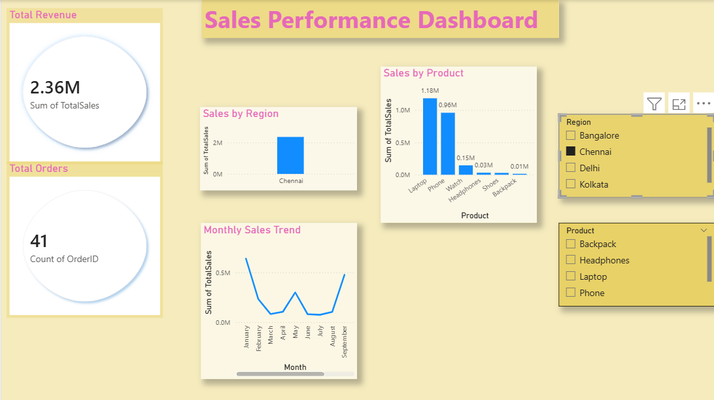

# 📊 Power BI Sales Dashboard

## 📌 Overview
This project showcases an interactive **Power BI Sales Dashboard** designed to analyze sales performance across regions, products, and time.  
It provides clear insights into revenue trends, top-performing categories, and business patterns.

---

## 🎯 Objectives
- Analyze overall sales performance  
- Identify top-performing products and regions  
- Track monthly sales trends  
- Enable interactive data exploration  

---

## 📈 Key Metrics
- **Total Revenue:** 2.36M  
- **Total Orders:** 41  

---

## 📊 Insights
- 📍 Chennai is the highest revenue-generating region  
- 💻 Laptops contribute the most to total sales  
- 📅 Sales vary across months, indicating trends  

---

## ⚙️ Features
- Region-wise sales analysis  
- Product-level performance comparison  
- Monthly trend visualization  
- Interactive filters (Region & Product)  

---

## 🛠️ Tools Used
- Power BI Desktop  
- Microsoft Excel  

---

## 📂 Project Structure
PowerBI_Sales_Dashboard/
│
├── data/
│ └── sales_data_powerbi.xlsx
│
├── dashboard/
│ └── sales_dashboard.pbix
│
├── assets/
│ └── dashboard.png
│
└── README.md
---

## 🚀 How to Use
1. Download the `.pbix` file from the `dashboard` folder  
2. Open it in Power BI Desktop  
3. Explore the dashboard using filters  

---

## 📄 License
This project is licensed under the MIT License.
